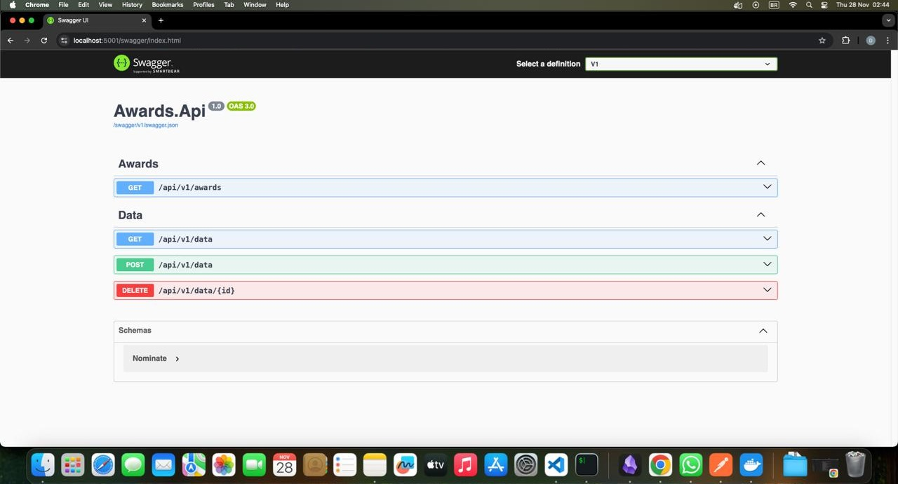

<p align="center"> 
		

</p>
<p align="center"><h1 align="center">Golden Raspberry Awards API</h1></p>
<h3 align="center">(AKA Razzie Awards)</h3>
 
<p align="center"> 
	
	
	
</p>
<p align="center"><!-- default option, no dependency badges. -->
</p>
<p align="center">
	<!-- default option, no dependency badges. -->
</p>
<br>

##  Table of Contents

- [ Overview](#overview)
- [ Features](#features)
- [ Project Structure](#project-structure) 
- [ Getting Started](#getting-started)
  - [ Prerequisites](#prerequisites)
  - [ Installation](#installation)
  - [ Usage](#usage)
  - [ Testing](#testing) 
- [ Contributing](#contributing)

---

##  Overview

Simple API that identifies the producer with the longest interval between two consecutive awards and the one who achieved two awards in the shortest time.

---

##  Features

The API also offers endpoint 'data' for data manipulation.

---

##  Project Structure

```sh
└── Golden-Raspberry-Awards/
    ├── raspberry.sln
    ├── src
    │   ├── Awards.Api
    │   ├── Awards.Domain
    │   ├── Awards.Infrastructure
    │   └── Awards.Service
    └── test
        └── AwardsService.IntegrationTests
```
 
---
##  Getting Started

###  Prerequisites

Before getting started with Golden-Raspberry-Awards, ensure your runtime environment meets the following requirements:

- **.NET Runtime:** Ensure the required version of the .NET Runtime is installed (e.g., <a href="https://dotnet.microsoft.com/pt-br/download/dotnet/9.0">.NET 9.0</a> or later).
- **Operating System:** Windows, macOS, or Linux (specify supported versions if applicable).
- **Dependencies:** Run ``` dotnet restore ``` to restore the project dependencies.
 
###  Installation

Run this project using one of the following methods:

**Build from source:**

1. Clone the Golden-Raspberry-Awards repository:
```sh
❯ git clone https://github.com/dkendy/Golden-Raspberry-Awards
```

2. Navigate to the project directory:
```sh
❯ cd Golden-Raspberry-Awards/src/Awards.Api
```

3. Install the project dependencies:

```sh
❯ dotnet restore
```

###  Usage
Run the api using the following command: 

```sh
❯ dotnet run
```
Open Swagger site: https://localhost:5001/swagger/index.html

<p align="center"> 
		 
</p>

###  Testing

1. Navigate to the project test directory:
```sh
❯ cd Golden-Raspberry-Awards/test/AwardsService.IntegrationTests
```

2. Run the test suite using the following command:


```sh
❯ dotnet test
```


---
 

##  Contributing

- **💬 [Join the Discussions](https://github.com/dkendy/Golden-Raspberry-Awards/discussions)**: Share your insights, provide feedback, or ask questions.
- **🐛 [Report Issues](https://github.com/dkendy/Golden-Raspberry-Awards/issues)**: Submit bugs found or log feature requests for the `Golden-Raspberry-Awards` project.
- **💡 [Submit Pull Requests](https://github.com/dkendy/Golden-Raspberry-Awards/blob/main/CONTRIBUTING.md)**: Review open PRs, and submit your own PRs.

<details closed>
<summary>Contributing Guidelines</summary>

1. **Fork the Repository**: Start by forking the project repository to your github account.
2. **Clone Locally**: Clone the forked repository to your local machine using a git client.
   ```sh
   git clone https://github.com/dkendy/Golden-Raspberry-Awards
   ```
3. **Create a New Branch**: Always work on a new branch, giving it a descriptive name.
   ```sh
   git checkout -b new-feature-x
   ```
4. **Make Your Changes**: Develop and test your changes locally.
5. **Commit Your Changes**: Commit with a clear message describing your updates.
   ```sh
   git commit -m 'Implemented new feature x.'
   ```
6. **Push to github**: Push the changes to your forked repository.
   ```sh
   git push origin new-feature-x
   ```
7. **Submit a Pull Request**: Create a PR against the original project repository. Clearly describe the changes and their motivations.
8. **Review**: Once your PR is reviewed and approved, it will be merged into the main branch. Congratulations on your contribution!
</details>

<details closed>
<summary>Contributor Graph</summary>
<br>
<p align="left">
   <a href="https://github.com{/dkendy/Golden-Raspberry-Awards/}graphs/contributors">
      
   </a>
</p>
</details>

